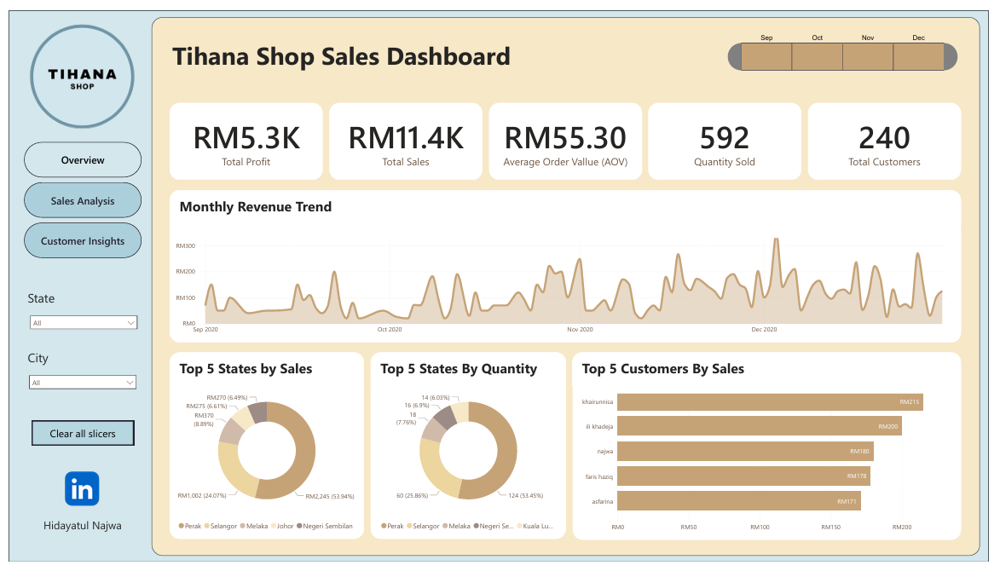
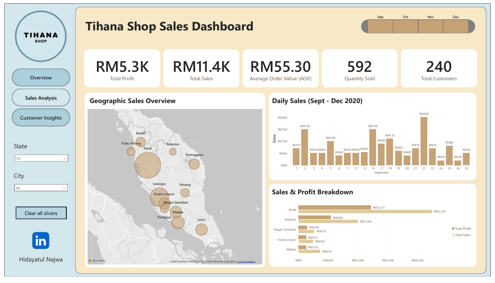
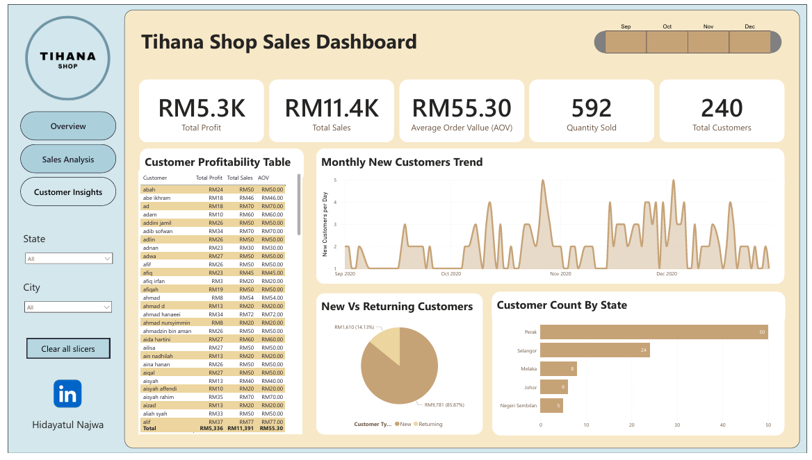
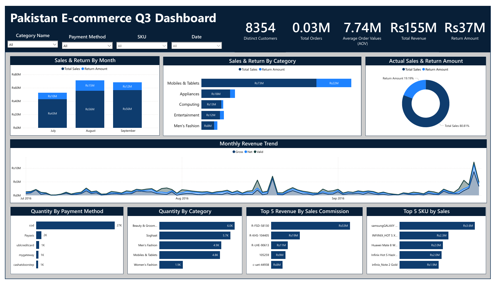

# Portfolio Projects
**About Me** 
I’m a data Analyst with a strong foundation in SQL, Python, Power BI, Excel, and Tableau, which I gained through academic projects at Universiti Sains Malaysia and hands-on experience. (BSc in Mathematics, Minor in Computer Science).  

Curious and self-driven, I enjoy transforming messy data into meaningful insights that drive decisions. From cleaning data to creating dashboards, I love every step of the process. I’ve worked on real-world projects involving sales, customer trends, and content performance, and I’m currently focused on sharpening my analytics skills through continuous learning and freelancing opportunities.  

Beyond numbers, I bring strong communication, attention to detail, and a collaborative mindset that help me explain technical findings simply and effectively.  

Now, I’m actively looking for opportunities in data analytics, where I can contribute, grow, and make an impact.  

## Below is a selection of my projects in SQL, Excel, Power BI, and Tableau:  

### (SQL + Power BI) Tihana Shop Sales Dashboard (Sept-Dec 2020)

*Seen on Power BI Public Service:* **[Dashboard](https://app.powerbi.com/groups/me/reports/34dedb97-9bc9-4d0d-b2c1-75bf97d41a3b?ctid=0ad0fbf8-69ca-4e5e-afad-cd70424ac626&pbi_source=linkShare)**   
*Review the Data Cleaning SQL Script:* **[HERE](SQL_Data_Cleaning_Tihana.sql)**   

  
  
  

### (SQL + Power BI) E-commerce Q3 Dashboard

Analyzed a fictional dataset representing Q3 e-commerce performance in Pakistan using Power BI. This interactive dashboard focuses on business-critical KPIs, category-level behavior, and monthly revenue trends to help stakeholders understand key patterns and challenges. 

Key Metrics:
- Total Revenue: Rs155M ( strong overall performance )
- Return Amount: Rs37M (~23.9% of revenue)
- Total Orders: 24.39K (Healthy order volume)
- Distinct Customers: 8.35K (solid customer reach)
- Average Order Value: Rs7.74M ( High AOV suggests expensive items or bulk orders)

Monthly Revenue Comparison:
- August was the best-performing month. (~Rs70M)
- Revenue grew from July to August, with a slight decline in September
- Indicates strong mid-quarter performance, possibly driven by promotions

Insights & Analysis:

Category-Level Insight:
- Mobiles & Tablets generated the highest revenue (Rs73M)
- Also had the highest returns (Rs22M), suggesting a need to review product quality or buyer expectations

Payment Method Behavior:
- Cash on Delivery (COD): 86.64%
- Card/Digital Payments: 13.36%
- Heavy COD usage highlights the trust gap in digital transactions. An opportunity for improvement

Product & Sales Analysis:
- Top SKU: Samsung Galaxy (Rs3.6M revenue)
- Top Sales Code: R-FSD-58130 (Rs53M revenue) — high-performing region or sales rep

Skills Used:
- SQL
- Power BI
- DAX
- Data Cleaning
- Data Visualization

*Seen on Power BI Public Service:* **[Dashboard](https://app.powerbi.com/groups/me/reports/17e66c59-ecce-44e5-82b7-708a5a6e4efb?ctid=0ad0fbf8-69ca-4e5e-afad-cd70424ac626&pbi_source=linkShare)**   
*Review the Data Cleaning SQL Script:* **[HERE](SQL_Data_Cleaning_Pakistanec.sql)**   
*Review the Data Exploratory SQL Script:* **[HERE](SQL_Data_Exploratory_Pakistanec.sql)**   

  

### (Excel + SQL) Sample Superstore Sales and Profit Performance Dashboard

- **Goal**: To analyze and visualize sales and profit trends by region, category, sub-category, and segment  
- **Skills**: SQL queries, Excel dashboards, KPI tracking, loss analysis  
*See on Excel:* **[Dashboard](https://github.com/hidayatulnajwa/Data-Analyst-Portfolio/blob/a83f7e025b199caf8cc689ffd4198463a6bd5a81/Excel%20-%20Sales%20and%20Profit%20Performance%20Dasboard.xlsx)**   
*Review the Data Cleaning SQL Script:* **[HERE](https://github.com/hidayatulnajwa/Data-Analyst-Portfolio/blob/481d323b85ea8b6d0176fc7e3ca0bdb968c95e12/SQL%20-%20Data%20Cleaning%20samplesuperstore.sql)**   

  

### SQL

- Pakistan's E-Commerce Dataset (Data exploration): **[HERE](SQL_Data_Exploratory_Pakistanec.sql)**  
- Pakistan's E-Commerce Dataset (Data Cleaning): **[HERE](SQL_Data_Cleaning_Pakistanec.sql)**  
- Layoffs Dataset (Data cleaning): **[HERE](SQL_Data_Cleaning_world_layoffs.sql)**   
- Layoffs Dataset (Data exploration): **[HERE](SQL_Data_Exploratory_world_layoffs.sql)**  
  
### Tableau 

*Click the hyperlink to access the Tableau Dashboards on Tableau Public*  

- Retail Supermarket Overview (without KPI): 
  https://public.tableau.com/shared/579W7YZYB?:display_count=n&:origin=viz_share_link 
    
- Superstore Dashboard: 
  https://public.tableau.com/views/Lab1_17136169330840/Dashboard1?:language=en-US&:sid=&:redirect=auth&:display_count=n&:origin=viz_share_link 
  

