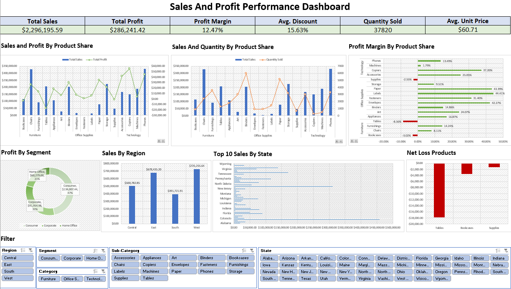
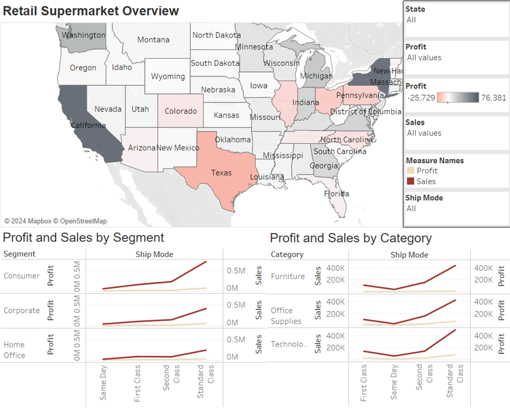
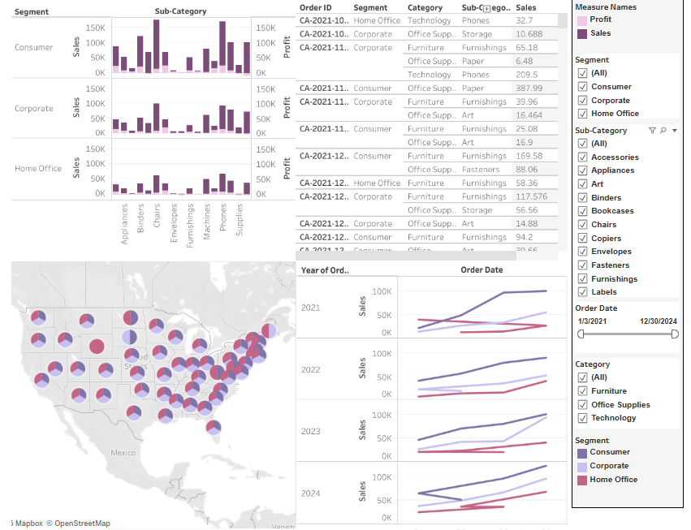

# Portfolio Projects
## Below is a selection of my projects in SQL, Excel, and Tableau:

### (Excel + MySQL) Sample Superstore Sales and Profit Performance Dashboard

- **Goal**: Analyze and visualize sales and profit trends by region, category, sub-category, and segment  
- **Skills**: SQL queries, Excel dashboards, KPI tracking, loss analysis  
*See on Excel:* **[Dashboard](https://github.com/hidayatulnajwa/Data-Analyst-Portfolio/blob/a83f7e025b199caf8cc689ffd4198463a6bd5a81/Excel%20-%20Sales%20and%20Profit%20Performance%20Dasboard.xlsx)**   
*Review the Data Cleaning SQL Script:* **[HERE](https://github.com/hidayatulnajwa/Data-Analyst-Portfolio/blob/481d323b85ea8b6d0176fc7e3ca0bdb968c95e12/SQL%20-%20Data%20Cleaning%20samplesuperstore.sql)**   

  

### SQL

- Layoffs Dataset (Data cleaning): **[HERE](SQL_Data_Cleaning_world_layoffs.sql)**   
- Layoffs Dataset (Data exploration): **[HERE](SQL_Data_Exploratory_world_layoffs.sql)**  
  
### Tableau 

*Click the hyperlink to access the Tableau Dashboards on Tableau Public*  

- Retail Supermarket Overview Dashboards (without KPI): 
  https://public.tableau.com/shared/579W7YZYB?:display_count=n&:origin=viz_share_link 
    
- Superstore Dashboard: 
  https://public.tableau.com/views/Lab1_17136169330840/Dashboard1?:language=en-US&:sid=&:redirect=auth&:display_count=n&:origin=viz_share_link 
  

